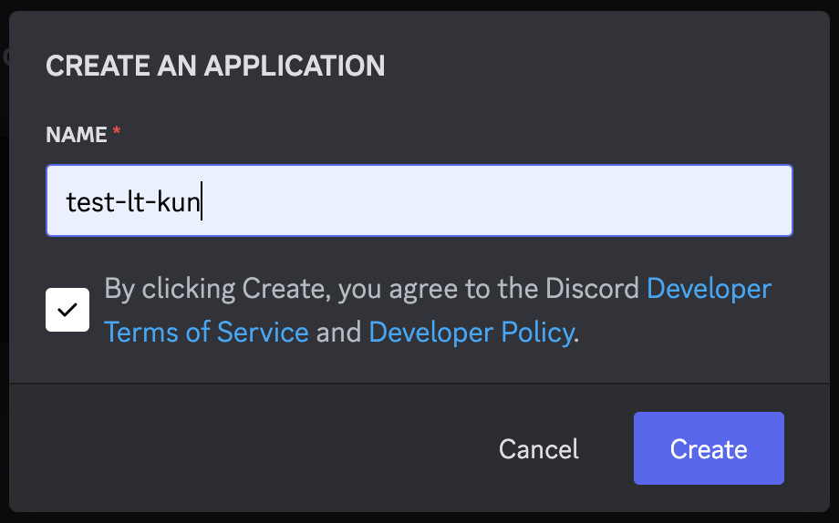
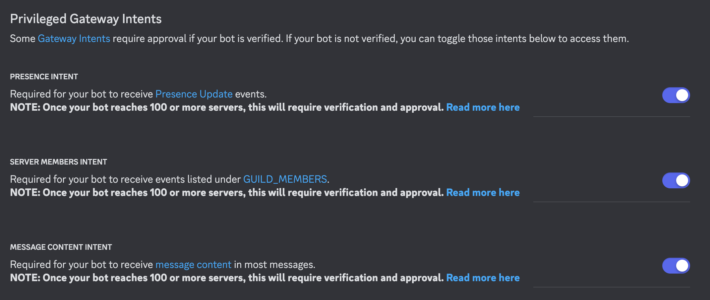
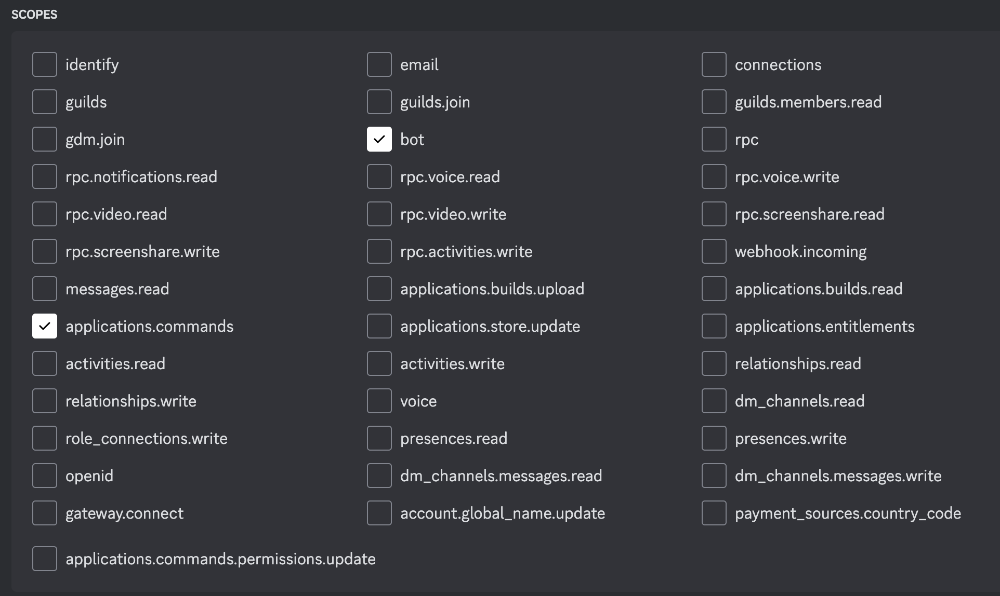

# デバッグ環境のセットアップ
## デバッグ用Discord サーバーの作成
[Discord公式docs サーバーの作り方](https://support.discord.com/hc/ja/articles/204849977-%E3%82%B5%E3%83%BC%E3%83%90%E3%83%BC%E3%81%AE%E4%BD%9C%E6%88%90%E3%81%AE%E4%BB%95%E6%96%B9)を参考にデバッグようのサーバーを作成してください。

## Discord Botの作成
1. [Discord Developer Portal](https://discord.com/developers/applications)へアクセスします。
2. `New Application`から新しいアプリケーションを作成します。



3. サイドバーから`Bot`を選択し、`Reset Token`を押します。
次のコマンドを実行して開発に必要な`.env`ファイルを作成します。(このトークンはコミットされません。)  
```sh
# LT-Kunのリポジトリで実行
echo "生成されたトークン" >> .env
```

4. そのまま`Bot`ページの下の`Privileged Gateway Intents`へ行きます
`PRESENCE INTENT, SERVER MEMBERS INTENT, MESSAGE CONTENT INTENT`全て許可します。  



## テストBotをデバッグ用サーバーに参加させる
1. サイドバーから`OAuth2`へ移動する
2. `SCOPES`で`bot`と`applications.commands`を許可する

3. 一番下の`GENERATED URL`をコピーしてブラウザでアクセスします。
4. デバッグ用のサーバーに参加させてください
